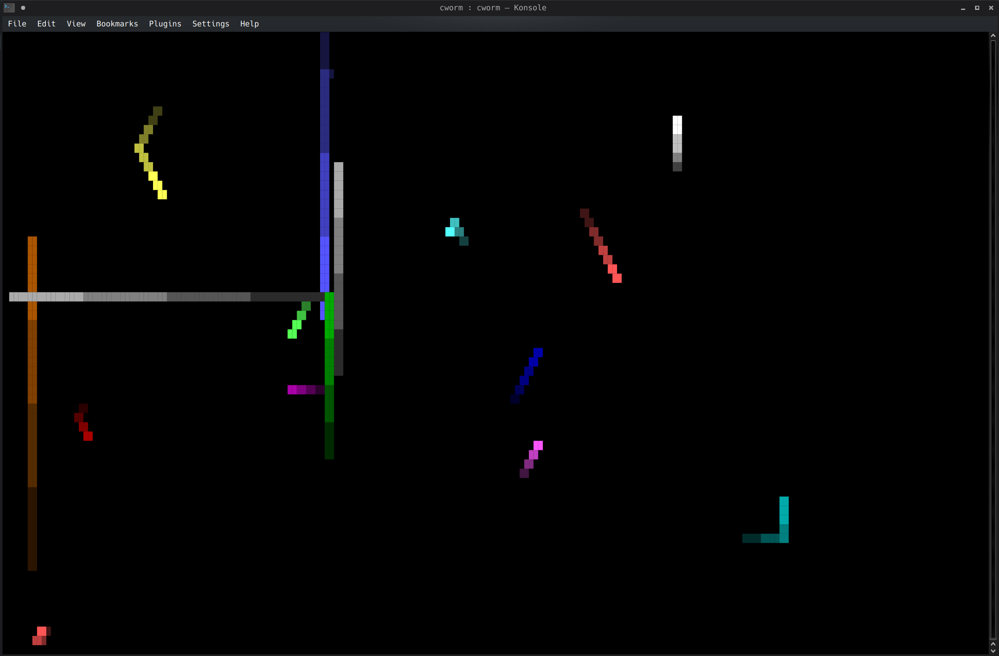

# cworm

A recreation of the NetWare MONITOR.NLM worm screensaver for your console.



---

## What it does

Spawns one colored worm per CPU core.  Each worm's length and speed are
proportional to that core's utilisation, sampled from `/proc/stat`.  An idle server gets slow, stubby worms.  
A server melting under load gets long, frantic ones.

---

## Usage

```
cargo build --release
./target/release/cworm
```


### Spike a core to watch it react

```bash
yes > /dev/null &   # peg one core at 100%
kill %1             # stop when satisfied
```

---

## Requirements

- Linux (reads `/proc/stat` and `/proc/loadavg`)
- A terminal that supports 24-bit colour and Unicode
- Tolerance for nostalgia

## Credits

Original NetWare worm screensaver: Jeff V. Merkey, Novell, 1994.

This project is a Rust port inspired by
[netware-cworthy-linux](https://github.com/jeffmerkey/netware-cworthy-linux).
